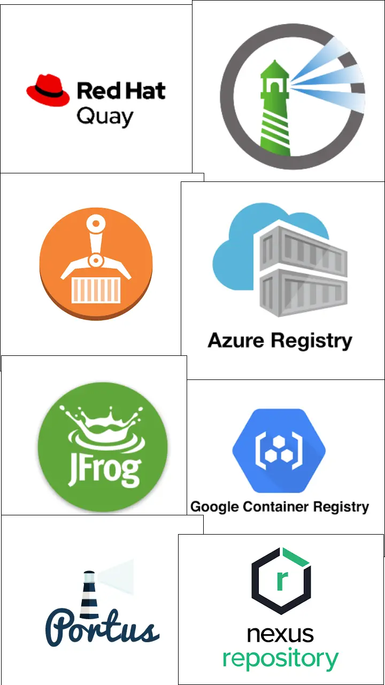
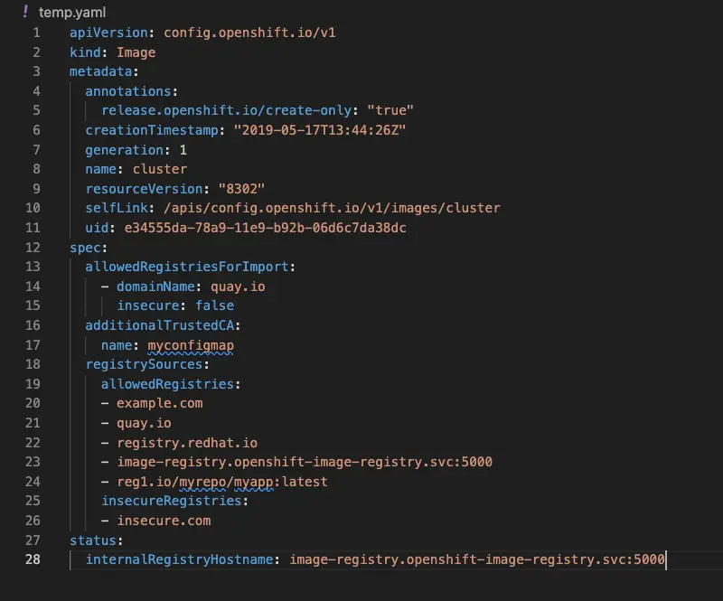
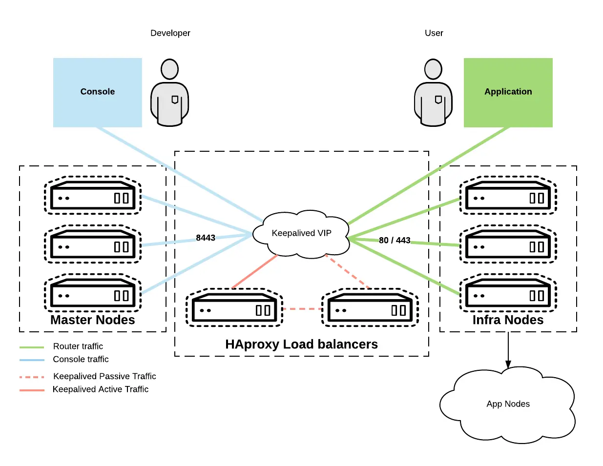

Running Applications in OpenShift Container Platform
===


##### A Guide to running Apps in OCP

###### by Mark DeNeve ([@xphyr][xphyr-gituhub])

[xphyr-github]: https://github.com/xphyr
[marpit]: https://github.com/marp-team/marpit
[marp-core]: https://github.com/marp-team/marp-core
[marp-cli]: https://github.com/marp-team/marp-cli
[marp-vscode]: https://github.com/marp-team/marp-vscode

---

## Who Am I

**Mark DeNeve
Principal Specialist Solutions Architect**

An Ops Guy
Aspiring Go Developer

- Twitter: [@markdeneve][mark-twitter]
- EMail:  
- GitHub: [@xphyr][xphyr-gituhub]


---

# What we'll discuss today

- OpenShift Developer UI
- Registry Configuration
- OpenShift - Secure by Default
- Best Practices for Containers on OpenShift
- Publishing Applications
- Telco Specific Hints and Tips

<!--
We have a big agenda for today. We are going to try and cover all of the following topics
In addtion we will talk about the demo app we will be working with to show some of these
techniques later on.

But before we get going on running applications, I want to talk a little about Registries and OpenShift
-->

---

# Container Registries



---

- OpenShift comes with a registry that can be enabled
    - Requires RWX Storage for High Availability
    - Authentication handled by OCP platform
- Can use existing corporate registry
- OpenShift will use any registry with a valid certificate that it can communicate with
    - This can be locked down if required


<!--
If you are not using a public registry like Docker Hub, Quay or GitHub Container Registry, you are going to need to do some additional configuration.
-->

---

# Using an existing Registry

- Existing registry must use TLS encryption
- Existing registry must have Properly signed (not self signed) certificate
- Container images must be “publicly accessible” (no auth)
- Can use existing corporate registry
**OR**
- Additional Configuration is required

---

# Trusting Self Signed Certificate Registries

Add Private Signing CA to cluster
- Must be done by cluster administrator
- End users can NOT add trusted registries

<!-- _footer: "*See [Setting up additional trusted CA](https://docs.openshift.com/container-platform/4.11/cicd/builds/setting-up-trusted-ca.html) for additional details*" -->

---

# Controlling Cluster Registry Access

**Allowed Registries** - list of registries that are allowed. If not on the list it is blocked.
**Insecure Registries** - list of registries that do not use TLS, but are acceptable
**Blocked Registries** - list of registries that are blocked. If it is not on this list it is allowed

***NOTE:*** *blockedRegistries and allowedRegistries are mutually exclusive*



<!-- _footer: "*See [Image Configuration Resources](https://docs.openshift.com/container-platform/4.11/openshift_images/image-configuration.html#images-configuration-file_image-configuration) for additional details*" -->

---

# Using Authentication with Container Registries

- Configure Per Cluster
  - Update the master pull secret for the whole cluster
- Configure Per Namespace
  - Create pull secret in each namespace that requires it

<!-- _footer: "*See [Using Image Pull Secrets](https://docs.openshift.com/container-platform/4.11/openshift_images/managing_images/using-image-pull-secrets.html) for additional details*" -->

---

# Containers for OCP


<!--
Now that we have discussed how to configure OpenShift to use an existing corporate registry and also how to lock down what registries can be used, lets get to the good stuff and discuss running containers in OCP.
-->

---

# OpenShift is Secured by DEFAULT

- SELinux is set to enforcing
- Security Context Constraints
  - “Restricted” by default
  - Use “Privileged” only if absolutely necessary
- Containers do not run as “root”
- Applications run as non-privileged user assigned by OCP (UID 10000+)

---

# Why lock it down?

Mitigates security risks inherent in running containers.

For Example CVE-2021-30465 was never a risk on an OpenShift Cluster due to the "security by default" stance of openshift.

<!-- _footer: "*See [CVE-2021030456 Mitigated by Default](https://cloud.redhat.com/blog/cve-2021-30465-mitigated-by-default-in-openshift) for additional details*" -->

---

# So what does that mean

Typical challenges when moving an app to OCP
- Containers running as root
  - Don’t!
- Specifying UID/GID in container
  - Don’t
- SCC - least privileges required to run your application
- Directory structure privileges need addressing 

---

# Project UID/GID/SELinux Labels

On Project/Namespace Creation:
- UserID Range, GID Range, and unique SELinux Labels are assigned
- These UID/GID and SELinux labels are UNIQUE to the namespace and will not overlap other projects
- This information for a given project can be viewed at the command line:

```
$ oc describe project guestbookphp
Name:			guestbookphp
Created:		4 days ago
Labels:			kubernetes.io/metadata.name=guestbookphp
			name=guestbookphp
			pod-security.kubernetes.io/audit=baseline
			pod-security.kubernetes.io/audit-version=v1.24
			pod-security.kubernetes.io/warn=baseline
			pod-security.kubernetes.io/warn-version=v1.24
Annotations:		kubectl.kubernetes.io/last-applied-configuration={"apiVersion":"v1","kind":"Namespace","metadata":{"annotations":{},"labels":{"name":"guestbookphp"},"name":"guestbookphp"}}	
			openshift.io/sa.scc.mcs=s0:c32,c14
			openshift.io/sa.scc.supplemental-groups=1001020000/10000
			openshift.io/sa.scc.uid-range=1001020000/10000
Display Name:		<none>
Description:		<none>
Status:			Active
Node Selector:		<none>
Quota:			<none>
Resource limits:	<none>
```

---

# But what if I need root?


---

# Introducing Security Context Constraints

What is an SCC? (Security Context Constraint)

By default there are 8:
- anyuid
- hostaccess
- hostmount-anyuid
- hostnetwork
- node-exporter
- nonroot
- privileged
- restricted
- restricted-v2
  
Restricted is the default SCC assigned to the “default” Service Account

---

# Restricted

Denies access to all host features and requires pods to be run with a UID, and SELinux context that are allocated to the namespace.
The restricted SCC:
- Ensures that pods cannot run as privileged
- Ensures that pods cannot mount host directory volumes
- Requires that a pod is run as a user in a pre-allocated range of UIDs
- Requires that a pod is run with a pre-allocated MCS label
- Allows pods to use any FSGroup
- Allows pods to use any supplemental group

Clusters that were upgraded from OpenShift Dedicated 4.10 or earlier, have “Restricted” SCC is available for use by any authenticated user. Th“Restricted” SCC is no longer available to users of new OpenShift Dedicated 4.11 or later installations, unless the access is explicitly granted.

---

# Restricted-v2

Like the restricted SCC, but with the following differences:
- ALL capabilities are dropped from containers.
- The NET_BIND_SERVICE capability can be added explicitly.
- seccompProfile is set to runtime/default by default.
- allowPrivilegeEscalation must be unset or set to false in security contexts.

This is the most restrictive SCC provided by a new installation and will be used by default for authenticated users starting with OCP 4.11

---

# nonroot

Provides all features of the restricted SCC, but allows users to run with any non-root UID. The user must specify the UID or it must be specified in the manifest of the container runtime.

---

# nonroot-v2

Like the nonroot SCC, but with the following differences:
- ALL capabilities are dropped from containers.
- The NET_BIND_SERVICE capability can be added explicitly.
- seccompProfile is set to runtime/default by default.
- allowPrivilegeEscalation must be unset or set to false in security contexts.

---

# anyuid

Provides all features of the restricted SCC, but allows users to run with any UID and any GID.

***NOTE:*** _This includes UID 0_

---

# privileged

Allows access to all privileged and host features and the ability to run as any user, any group, any FSGroup, and with any SELinux context.
This is the most relaxed SCC and should be used only for cluster administration. Grant with caution.
The privileged SCC allows:
- Users to run privileged pods
- Pods to mount host directories as volumes
- Pods to run as any user
- Pods to run with any MCS label
- Pods to use the host’s IPC namespace
- Pods to use the host’s PID namespace
- Pods to use any FSGroup
- Pods to use any supplemental group
- Pods to use any seccomp profiles
- Pods to request any capabilities

---

# Container File System best practices
## since we are not running containers as root

Make directories and files you want to write to group-writable and owned by group id 0


To your Docker file add:

```
RUN chgrp -R 0 /some/directory && \
   chmod -R g=u /some/directory
```

Where “/some directory” is any directory that you want to be able to write to.
Keep in mind that you should be mounting a Persistent Volume of EmptyDir Volume on any filesystem you want to write to.
OpenShift will automatically make the container user a part of Group 0, so you do not need to worry about filesystem ownership

---

# Accessing your App outside the cluster



---

# OpenShift Routes

A route allows you to host your application at a public URL. It can either be secure or unsecured, depending on the network security configuration of your application.

- Similar to K8s “Ingress” or “Gateway API” 
- OpenShift Routes also support “Ingress” notation

---

# Node Port

Kubernetes “NodePort” is also supported

---

# Other Advanced/Third Party Options

- MetalLB
- F5 Integration
- Citrix Integration
- Cloud Provider Integration (AWS, Azure, Google, etc)
- Others

---

# A Word(or 60) about Network Policies

By default any project can talk to any other project
You can add network policies to projects to restrict this

```
kind: NetworkPolicy
apiVersion: networking.k8s.io/v1
metadata:
  name: allow-same-namespace
spec:
  podSelector: {}
  ingress:
  - from:
    - podSelector: {}
```

The above example would make a project that matches all pods, but accepts no traffic from pods outside the project

<!-- _footer: "*See [About Network Policies](https://docs.openshift.com/container-platform/4.11/networking/network_policy/about-network-policy.html) for additional details*" -->

---

# Universal Base Images (UBI)

The Red Hat Universal Base Image (UBI) is a collection of Open Container Initiative (OCI)-compliant, freely redistributable, container base operating system images. There are several options to choose from that vary in size, complexity, or that include language runtimes and packages. All of the packages in UBI come from Red Hat Enterprise Linux (RHEL) and are supported like RHEL when run on a Red Hat supported platform like OpenShift or Red Hat Enterprise Linux.

---

# What do I get?

The Red Hat Universal Base Image includes 3 things:

- Four base images for a variety of use cases.
- A set of language runtime images to enable you to start coding right away.
- A set of YUM repositories/channels that include RPM packages that allow you to rebuild UBI container images anytime.

All UBI images are fully supported when running on RHEL or OpenShift systems with active subscriptions. If running on other systems, they are supported by the community and receive Red Hat updates.

---

# Additional Benefits of using UBI

- Use the same base image that Red Hat uses for its products
- Use a base image that is regularly scanned and updated for known vulnerabilities using the same engine and security sources as other Red Hat products
- Easy to obtain source code to comply with Open Source licensing requirements
- Build on any OCI-compliant environment
- Freely redistribute your UBI-based product under the terms of the UBI EULA

# How do I use UBI

```
$ podman pull registry.access.redhat.com/ubi8/ubi
```

---

# Running Telco Workloads


---

# Some Features May need to be Enabled

- Real Time Kernel and Low Latency 
- Stream Control Transmission Protocol is not enabled by default
- OpenShift Virtualization may need to be installed

---

# Using TCPdump in OpenShift
### Because sometimes you just need to see the packets

You can embed tcpdump from the start:
```
FROM registry.access.redhat.com/ubi8/ubi
RUN yum update && yum install tcpdump
```

or Leverage a Side-car

```
- name: tcpdump
  image: corfr/tcpdump
  command:
     - /bin/sleep
     - infinity
```
---

